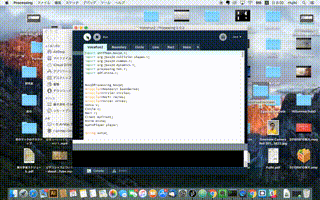

VoiceFun
====

Overview
音声認識エンジンJuliusとProcessingを使用した、人の声に反応するインタラクティブアート
## Description
あらかじめ自身のパソコンに音声認識エンジンJuliusとProcessingをインストールする必要がある。
Juliusをサーバーモードで起動してから、Processingのプロジェクトファイルをrunする。
人の声に反応して背景色が変わり、文字や図形が描画される。

## Demo

## Author

[BigHappy](https://github.com/BigHappy)
